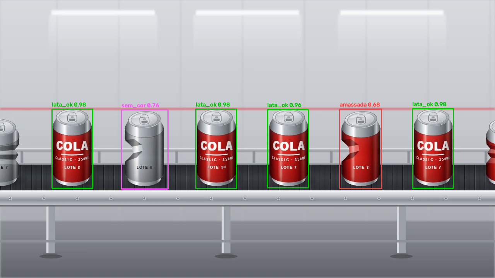

# Inspeção Visual Automática de Qualidade — Edge AI na Raspberry Pi 5

Sistema embarcado de visão computacional que inspeciona latas numa esteira e classifica cada uma como
**conforme** ou **não conforme** em tempo real. As reprovadas acionam uma saída digital (GPIO/relé) que
sopra a lata para fora da linha, e cada não conformidade é registrada com imagem anotada.
Toda a inferência roda na borda, na CPU, sem nenhum serviço de nuvem.

Projeto nº 2 da *Matriz de Projetos – Edge AI / Visão Computacional*: **Inspeção Visual Automática de
Qualidade em Linha de Produção**.



| | |
| --- | --- |
| **Modelo** | YOLO26n (Ultralytics) com ajuste fino em 4 classes, exportado para **NCNN** |
| **Classes** | `lata_ok` (conforme) · `amassada` · `sem_rotulo` · `sem_cor` (não conformes) |
| **API** | FastAPI: `/detectar` (JSON) e `/detectar/imagem` (PNG anotado) + Swagger em `/docs` |
| **Container** | Docker multi-arquitetura `linux/amd64` + `linux/arm64`, `restart: always`, porta 8000 |
| **Saídas** | GPIO 17 (soprador), CSV por lata, imagens anotadas, leitura do lote por OCR |
| **Material didático** | [Plano de Aula (PDF)](docs/Como_Ensinar_Inspecao_Visual_Edge_AI_Plano_de_Aula.pdf) |

---

## Sumário
1. [Início rápido (Docker)](#1-início-rápido-docker)
2. [Endpoints HTTP: exemplos de requisição e resposta](#2-endpoints-http)
3. [Escolha do modelo e justificativa](#3-escolha-do-modelo-e-justificativa)
4. [Pipeline de inferência](#4-pipeline-de-inferência)
5. [Desempenho e viabilidade embarcada](#5-desempenho-e-viabilidade-embarcada)
6. [Adaptações para a Raspberry Pi 5](#6-adaptações-para-a-raspberry-pi-5)
7. [Build multi-arquitetura](#7-build-multi-arquitetura-amd64--arm64)
8. [Estrutura do repositório e ciclo completo](#8-estrutura-do-repositório-e-ciclo-completo)
9. [Problemas encontrados e como foram resolvidos](#9-problemas-encontrados-e-como-foram-resolvidos)

---

## 1. Início rápido (Docker)

Pré-requisito: Docker com o plugin Compose (Docker Desktop no Windows/macOS, Docker Engine no Linux).

```sh
git clone https://github.com/geanusksama/inspecao-latas.git
cd inspecao-latas
docker compose up -d --build
```

- A API sobe em **http://localhost:8000/docs** (Swagger: dá para enviar uma imagem e ver a resposta pelo navegador).
- `restart: always`: o container volta sozinho após uma queda ou reinício da máquina.
- Status: `curl http://localhost:8000/saude`

**Inspeção de vídeo** (linha virtual, rastreio, sopro, CSV), pelo menu dentro do mesmo container:
```sh
docker compose exec inspecao python scripts/menu.py
```
Opção 1 inspeciona o vídeo de demonstração (`esteirafull.mp4`, 84 s) e opção 2 mostra o relatório de
conformidade e os lotes afetados. Os resultados ficam em `./saida`.

**Na Raspberry Pi 5:** veja o passo a passo em [`raspberry/LEIAME.md`](raspberry/LEIAME.md) (`sh raspberry/iniciar.sh`).

**Guia para quem nunca usou Docker** (testar no PC e na Raspberry, passo a passo): [`COMO_TESTAR.md`](COMO_TESTAR.md).

---

## 2. Endpoints HTTP

| Método | Rota | Entrada | Saída |
| --- | --- | --- | --- |
| GET | `/saude` | — | status e modelo carregado |
| POST | `/detectar` | imagem (multipart, campo `arquivo`) | JSON: detecções, resumo, metadados |
| POST | `/detectar/imagem` | imagem (multipart, campo `arquivo`) | PNG com caixas e rótulos |
| GET | `/docs` | — | Swagger UI |

### `POST /detectar` → JSON
```sh
curl -F "arquivo=@dataset/imagens/curto_000090.jpg" http://localhost:8000/detectar
```
Resposta real (CPU, NCNN; uma detecção mostrada, as outras omitidas):
```json
{
  "deteccoes": [
    {"classe": "lata_ok", "confianca": 0.982, "conforme": true,
     "caixa": {"x1": 134, "y1": 282, "x2": 239, "y2": 487}}
  ],
  "resumo": {"total": 6, "conformes": 4, "nao_conformes": 2},
  "metadados": {
    "modelo": "YOLO26n ajustado (4 classes)",
    "formato": "ncnn",
    "imagem": {"largura": 1280, "altura": 720},
    "confianca_minima": 0.5,
    "tempo_ms": {"preprocess": 31.5, "inference": 110.6, "postprocess": 27.4}
  }
}
```

### `POST /detectar/imagem` → PNG
```sh
curl -F "arquivo=@dataset/imagens/curto_000090.jpg" http://localhost:8000/detectar/imagem -o anotada.png
```
Devolve `image/png` com cada lata marcada na cor da sua classe e a confiança (imagem do topo deste README).

### Erros tratados
| Situação | HTTP | Mensagem |
| --- | --- | --- |
| Arquivo vazio | 400 | `Arquivo vazio.` |
| Não é imagem | 400 | `O arquivo não é uma imagem válida (use JPG ou PNG).` |
| Maior que 10 MB | 413 | `Imagem maior que 10 MB.` (protege os 2 GB de RAM da placa) |

---

## 3. Escolha do modelo e justificativa

**YOLO26n**, a versão *nano* do YOLO26 da Ultralytics, com **ajuste fino** (*transfer learning*) a partir
dos pesos pré-treinados no COCO (80 classes).

| Requisito do cenário | Por que o YOLO26n atende |
| --- | --- |
| **Latência**: a esteira passa ~1,9 lata/s e a decisão precisa sair antes do soprador | É o menor modelo da família (2,4 M de parâmetros). Na Raspberry Pi 5, a Ultralytics publica **67 ms/imagem** em NCNN a 640 px ([guia oficial](https://docs.ultralytics.com/guides/raspberry-pi/)), cerca de 15 FPS. |
| **Precisão**: defeitos visualmente claros (forma, rótulo, cor) em objetos grandes na imagem | Detector de um estágio com boa precisão em objetos médios e grandes. No nosso conjunto de validação: **mAP50 = 0,93**, mAP50-95 = 0,83. |
| **Detecção, e não só classificação** | Várias latas por quadro: é preciso saber **onde** está cada uma para seguir a lata até a linha de decisão e acionar o sopro na hora certa. Um classificador (MobileNet) daria um rótulo por imagem inteira. |
| **Implantação embarcada** | A exportação para NCNN, ONNX, TFLite e OpenVINO é nativa na Ultralytics, e o mesmo código roda em `.pt` (PC) e NCNN (Raspberry). |

**Alternativas consideradas:** MobileNet-SSD e EfficientDet-Lite também são leves, mas exigiriam outra
cadeia de treino e exportação. Modelos maiores (YOLO26s/m) ganham pouca precisão num problema com defeitos
tão visíveis e multiplicam a latência na CPU.

**Treino:** 60 quadros do vídeo de treino (48 de treino, 12 de validação), anotados à mão e com
pré-rotulagem assistida pelo próprio modelo; 30 épocas, 640 px, cerca de 94 s numa GTX 1650.
Limitação honesta: a validação tem só 12 imagens, e a classe `sem_cor` (lata prateada lisa) tem poucos
exemplos. Mais dados dessa classe são o próximo passo de melhoria.

---

## 4. Pipeline de inferência

```
             ┌──────────────── API (scripts/api.py) ───────────────┐
upload  ──►  │ pré-processamento   bytes → cv2.imdecode → BGR       │
(JPG/PNG)    │                     valida tamanho e formato (400/413)│
             │ inferência          YOLO NCNN (letterbox 640 px, CPU) │
             │ pós-processamento   caixas → JSON  ou  → PNG anotado  │
             └──────────────────────────────────────────────────────┘

vídeo / câmera ──► detectar + rastrear (ByteTrack) ──► lata cruzou a linha?
                    (scripts/inspecao.py)                 │ sim: classe = voto da maioria dos quadros
                                                          ├─► CSV + imagem anotada + recorte
                                                          └─► não conforme? → pulso no GPIO 17 (soprador)
```

- **Um modelo, carregado uma vez** na subida da API (e não a cada requisição), com trava para inferências concorrentes.
- **Voto por maioria:** na inspeção de vídeo, cada quadro é um voto de classe; ao cruzar a linha, vence a classe mais vista. Um quadro ruim não decide sozinho.
- **`agnostic_nms`:** se a mesma lata receber duas caixas de classes diferentes, fica só a mais forte. Sem isso, a contagem do vídeo de teste dava 164 latas em vez de 160.

---

## 5. Desempenho e viabilidade embarcada

### Medido neste projeto (`python scripts/9_benchmark.py`)
Intel Core i5-10500H (x86-64, 6 núcleos/12 threads) + GTX 1650, Windows 11, 04/10/2026. 100 quadros 1280×720
do vídeo da esteira, entrada de 640 px, tempo total do `predict` (pré + inferência + pós). Tabela gerada em
[`docs/benchmark.md`](docs/benchmark.md).

| Modelo | Onde | Mediana (ms) | P95 (ms) | FPS |
| --- | --- | --- | --- | --- |
| PyTorch (`best.pt`) | CPU x86 | 53,5 | 79,4 | 18,7 |
| NCNN (`best_ncnn_model`) | CPU x86 | 86,8 | 104,2 | 11,5 |
| PyTorch (`best.pt`) | GPU GTX 1650 | 26,3 | 36,0 | 38,1 |

**Leitura honesta:** no x86, o NCNN ficou **mais lento** que o PyTorch. O PyTorch usa bibliotecas da Intel
muito otimizadas para esse processador, enquanto o NCNN é otimizado para **ARM**. Por isso a decisão do formato
para a Raspberry se apoia na medição oficial **na própria Pi 5** (abaixo), em que o NCNN é o mais rápido.
Lição para a aula: *benchmark se faz no hardware alvo*. O número do notebook não se transfere para a placa.

### Referência oficial: Raspberry Pi 5, YOLO26n, 640 px, FP32
Fonte: [Ultralytics — Raspberry Pi guide](https://docs.ultralytics.com/guides/raspberry-pi/) (consultado em 04/10/2026).

| Formato | ms/imagem | mAP50-95 (COCO) |
| --- | --- | --- |
| PyTorch | 299,09 | 0,4760 |
| ONNX | 125,99 | 0,4734 |
| OpenVINO | 104,55 | 0,4734 |
| MNN | 91,87 | 0,4749 |
| **NCNN** | **67,03** | **0,4784** |

O NCNN é o formato mais rápido na Pi 5, cerca de 4,5× mais rápido que o PyTorch, sem perda de precisão. Por isso é o formato do container.

### A latência é aceitável para esta linha?
| Grandeza | Valor | De onde vem |
| --- | --- | --- |
| Latas por segundo | ~1,9 | 160 latas em 84 s no vídeo da esteira |
| Intervalo entre latas | ~525 ms | 1 ÷ 1,9 |
| Tempo de uma lata atravessando a imagem | ~3,6 s | esteira a ~12 px/quadro, imagem de 1280 px, 30 fps |
| Inferência estimada na Pi 5 (NCNN, 640 px) | ~67 ms (~15 FPS) | referência oficial acima |
| Quadros analisados por lata | ~50 | 3,6 s × 15 FPS |

Cada decisão leva cerca de **8× menos tempo que o intervalo entre latas**, e cada lata é vista dezenas de
vezes antes de cruzar a linha, o que alimenta o voto por maioria. Mesmo processando só 1 de cada 2 quadros
da câmera, a lata anda ~24 px entre análises, bem menos que sua largura (~105 px), e o rastreador não a
perde. **Conclusão:** viável em tempo real na Pi 5 com
NCNN a 640 px. Se a esteira acelerar 3×, basta reduzir a entrada para 320 px (¼ dos pixels) ou usar um
acelerador NPU (seção 6).

---

## 6. Adaptações para a Raspberry Pi 5

A implementação e os testes foram feitos num PC (Windows, x86-64, GTX 1650). Estas são as diferenças da
Raspberry Pi 5 e como o projeto trata cada uma:

| Diferença da Pi 5 | Adaptação feita |
| --- | --- |
| **CPU ARM64 (Cortex-A76)** | Imagem Docker multi-arquitetura via `docker buildx` (seção 7); base `python:3.12-slim-bookworm` e todos os pacotes com wheels `aarch64`. Imagem `linux/arm64` montada **e executada** em emulação QEMU (`uname -m` = `aarch64`): `/saude`, `/detectar` e `/detectar/imagem` deram o mesmo resultado do amd64. |
| **Sem GPU dedicada (sem CUDA)** | PyTorch **só CPU** no container (índice `whl/cpu`, imagem menor) e inferência em **NCNN**, otimizado para ARM. A mesma imagem usa NCNN também no x86 por simplicidade; num servidor x86 o PyTorch na CPU seria mais rápido (seção 5). |
| **2 GB de RAM** | Container só de inferência (sem treino nem dataset); modelo carregado uma vez; uploads limitados a 10 MB; OCR do lote roda fora da linha (`7_ler_lotes.py`), e não durante a inspeção. |
| **32 GB de armazenamento** | `.dockerignore` deixa de fora dataset, treinos e curso; resultados ficam num volume (`./saida`), limpos pelo operador. |
| **NPU / aceleradores** | Não usado nesta versão. Caminho de evolução: Raspberry Pi AI HAT+ (Hailo), exportando o modelo para o formato do fabricante, para liberar a CPU e subir o FPS. |
| **Quantização** | NCNN em FP32 já atende a latência (seção 5). Opções se precisar de mais: FP16 (`half=True` na exportação) ou INT8 (TFLite/OpenVINO), medindo a perda de mAP no nosso conjunto antes de adotar. |
| **GPIO do soprador** | `gpiozero` + `lgpio` (Pi 5); container com `privileged: true` em `raspberry/docker-compose.yml`. No PC a saída fica em modo simulado e o mesmo código roda. |
| **Sem monitor** | `SEM_TELA=1` no container: o menu vai direto para a inspeção sem janela. |

### Como validar na placa
1. Raspberry Pi OS **64-bit**; `git clone` e `sh raspberry/iniciar.sh` (instala o Docker, monta a imagem arm64 e sobe a API com `restart: always`).
2. `curl http://IP-da-pi:8000/saude` deve responder `"formato": "ncnn"`.
3. `docker compose exec inspecao python scripts/9_benchmark.py`: comparar a mediana do NCNN com a referência de ~67 ms.
4. Menu → opção 1 com `esteirafull.mp4`: o resumo deve dar **160 latas (96 conformes / 64 não conformes)**, a mesma contagem do PC.
5. Ligar um LED ou relé no GPIO 17 e conferir um pulso por lata reprovada (64 no vídeo).
6. Rodar 30 min contínuos e monitorar a temperatura (`vcgencmd measure_temp`): com cooler ativo não deve haver *throttling*.

---

## 7. Build multi-arquitetura (amd64 + arm64)

```sh
# uma vez: builder com suporte a várias plataformas (Docker Desktop já inclui QEMU)
docker buildx create --use --name multi
# gera as duas arquiteturas a partir do mesmo Dockerfile
docker buildx build --platform linux/amd64,linux/arm64 -t inspecao-latas:1.0 --load .
# para publicar num registro (ex.: Docker Hub), troque --load por --push e use usuario/inspecao-latas:1.0
```
A mesma imagem `inspecao-latas:1.0` foi gerada para `linux/amd64` e `linux/arm64` com esse comando.
O `docker-compose.yml` monta a arquitetura da máquina em que roda.

---

## 8. Estrutura do repositório e ciclo completo

```
inspecao-latas/
├── README.md                    este documento
├── Dockerfile                   imagem de inferência (API + inspeção), amd64/arm64
├── docker-compose.yml           PC / notebook / VM / nuvem: porta 8000, restart: always
├── requirements.txt             ambiente de desenvolvimento no PC (treino)
├── requirements-docker.txt      bibliotecas do container
├── raspberry/                   versão da Raspberry Pi 5
│   ├── docker-compose.yml       + GPIO (privileged), sobe no boot
│   ├── iniciar.sh               instala o Docker, monta e sobe
│   └── LEIAME.md                passo a passo na placa
├── scripts/                     todo o código Python (etapas numeradas na ordem de uso)
├── treinos/latas/weights/       best.pt (PyTorch) e best_ncnn_model/ (NCNN)
├── dataset/                     60 imagens + 60 rótulos YOLO
├── vtrieino/ · esteirafull.mp4  vídeo de treino e vídeo de teste da esteira
└── docs/                        plano de aula (PDF), benchmark, imagem de exemplo
```

| Etapa | Script | O que faz |
| --- | --- | --- |
| 0 | `0_verificar_gpu.py` | Confere se o PyTorch vê a GPU |
| 1 | `1_capturar.py` | Extrai 1 quadro a cada 10 do vídeo de treino |
| 2 | `2_anotar.py` | Ferramenta de anotação (OpenCV) no formato YOLO |
| 3 | `3_separar.py` | Divide treino/validação (80/20) e gera o `data.yaml` |
| 4 | `4_treinar.py` | Ajuste fino do YOLO26n na GPU |
| 5 | `5_prerotular.py` | Pré-rotulagem assistida pelo modelo (opcional) |
| 6 | `6_inspecionar.py` · `6_inspecionar_basico.py` | Inspeção de vídeo com tela / sem tela |
| 7 | `7_ler_lotes.py` | Lê o lote das latas reprovadas (OCR, fora da linha) |
| 8 | `8_exportar_ncnn.py` | Exporta o modelo para NCNN |
| 9 | `9_benchmark.py` | Mede a latência PyTorch × NCNN |
| — | `api.py` · `menu.py` · `inspecao.py` · `saida_gpio.py` · `config.py` | API, menu, lógica comum, GPIO, configuração |

**Ambiente de desenvolvimento (PC com GPU NVIDIA):**
```sh
python -m venv venv && venv\Scripts\activate        # Linux: source venv/bin/activate
pip install torch==2.14.1 torchvision==0.29.1 --index-url https://download.pytorch.org/whl/cu130
pip install -r requirements.txt
python scripts/0_verificar_gpu.py
```

---

## 9. Problemas encontrados e como foram resolvidos

| Problema | Como foi medido | Solução |
| --- | --- | --- |
| `torchvision` instalado só para CPU quebrava o treino na GPU | erro `torchvision::nms` no backend CUDA | `torchvision` da mesma build CUDA do `torch` |
| OCR do lote travava o vídeo a cada lata | ~400 ms por leitura | leitura do lote movida para depois da inspeção (`7_ler_lotes.py`) |
| Rastreador padrão (BoT-SORT) gastava tempo compensando movimento de uma câmera fixa | 36 → 22 ms por quadro | ByteTrack |
| Duas caixas de classes diferentes na mesma lata | 164 latas em vez de 160 | `agnostic_nms=True` |
| Confiança baixa demais gerava caixas duplicadas | 203 latas | confiança mínima 0,5 |
| Primeiro quadro lento (carga do modelo) fazia a versão com tela pular latas | 155 latas | relógio de tempo real só após o 1º quadro |
| Caixas encolhiam 1 px a cada reabertura na anotação | teste de ida e volta | `round()` em vez de `int()` |

A contagem de referência (**160 latas**) vem da velocidade medida da esteira (~12 px/quadro) e do
espaçamento entre latas, e foi usada para validar cada mudança.
